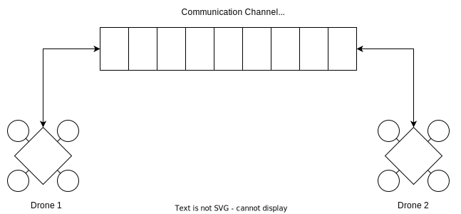

# Points to Note

1. There exists a ground control that works as a Database
   1. Weather Data is centralized
   2. High Level Decisions

## TODO

1. Make the Event,Delegate pattern work in python
2. Make a Cell Object

## Metrics

1. Traffic Rate
2. Drone Velocity
3. Minimum Distance between Drone
4. Traffic Density: Total Number of Vehicles in the Air Space
5. Weather Monitoring

## Cell Class

1. Occupied: Boolean
2. Weather: Maybe a seperate Data Structure

## Inter-drone communication model

The simulation of inter-drone communication entails the following:
1. A drone e.g. Drone 1 periodically "publishes" a message onto the channel
2. Any drone e.g. Drone 2 can read from the channel. Hence, Drone 2 is a "subscriber"
This is why the model is called Publisher-Subscriber model.

## Paper Structure

Introduction - problem description
Lit Review - Introduce the acronyms, what other people are doing
Model - What have you done with regards to the problem statement
Experiments & Results - Proving the model is right
